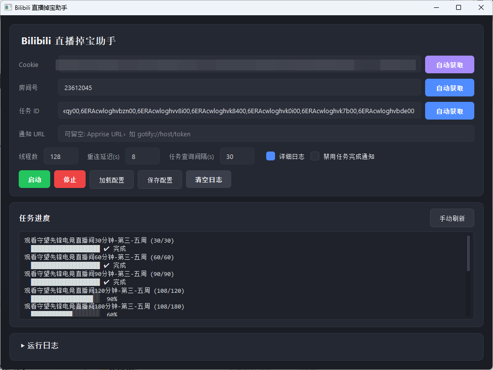

# Bilibili 直播掉宝助手

[下载](https://github.com/mi0e/BiliBiliDropsMiner/releases/latest) [国内下载](https://ghfast.top/https://github.com/mi0e/BiliBiliDropsMiner/releases/latest/download/bilibili-drops-miner-gui.exe)

B 站直播掉宝 / 观看时长任务的自动挂机工具，支持多线程倍速完成任务，可用 CLI 和 GUI 两种模式。



## 功能

- 多线程可实现任务加速（特定直播间自行测试）
- 自动连接直播间并维持 WebSocket + x25Kn 观看时长心跳
- 支持多房间同时挂机
- 任务进度实时追踪与可视化（分组进度条）
- 任务完成通知推送（企业微信、Gotify、Server 酱等）
- 运行参数动态修改，无需重启即可生效
- GUI / CLI 双模式，支持打包为独立 EXE

> **关于多线程加速：** 每房间可开多个会话，实测可叠加观看时长。效果因直播间而异，请自行测试。线程间自动错峰 3 秒启动以避免会话冲突。

## 安装

```bash
pip install -r requirements.txt
```

依赖：httpx、websockets、brotli、colorama、customtkinter、apprise

## 使用方法

### GUI 模式（推荐）

```bash
python bilibili_gui.py
```

填入 Cookie、房间号、任务 ID 后点击「启动」即可。

### CLI 模式

```bash
python bilibili.py \
  --cookie "SESSDATA=xxx; bili_jct=xxx" \
  --rooms "23612045" \
  --task-ids "taskId1,taskId2" \
  -v
```

<details>
<summary>CLI 完整参数列表</summary>

| 参数 | 说明 | 默认值 |
|---|---|---|
| `--cookie` | B 站登录 Cookie | 必填 |
| `--rooms` | 房间号，逗号分隔 | 必填 |
| `--threads` | 每房间会话数（可加速任务进度） | 1 |
| `--heartbeat-interval` | WS 心跳间隔（秒） | 30 |
| `--reconnect-delay` | 断线重连延迟（秒） | 8 |
| `--task-ids` | 任务 ID 列表，逗号分隔 | 空 |
| `--task-interval` | 任务进度查询间隔（秒） | 30 |
| `--notify-urls` | Apprise 通知 URL，逗号分隔 | 空 |
| `--disable-web-heartbeat` | 关闭 x25Kn 观看时长心跳 | false |
| `--disable-task-notify` | 关闭任务完成通知 | false |
| `-v` / `--verbose` | 显示详细调试日志 | false |

</details>

## 如何获取参数

### Cookie

浏览器登录 B 站 → F12 开发者工具 → 控制台 / Console → 输入以下命令回车：

```js
copy(document.cookie)
```

Cookie 已复制到剪贴板，直接粘贴到程序中即可。

需要包含 `SESSDATA`、`bili_jct`、`DedeUserID` 等字段。

### 房间号

直播间 URL 中的数字，如 `https://live.bilibili.com/23612045` → 房间号为 `23612045`。

### 任务 ID

#### 方法一：自动获取（推荐）

GUI 中点击「自动获取任务ID」→ 在打开的浏览器中进入任务页面并刷新 → task_ids 自动填充。

#### 方法二：手动提取

1. 前往 B 站活动任务页面
2. F12 开发者工具 → 网络 / Network
3. 点击页面上的刷新按钮，找到如下请求：
   ```
   https://api.bilibili.com/x/task/totalv2?csrf=xxx&task_ids=taskId1,taskId2,...&web_location=0.0
   ```
4. 从 `task_ids` 参数中提取，逗号分隔填入即可

## 通知推送

基于 [Apprise](https://github.com/caronc/apprise)，支持 80+ 通知平台。常用示例：

| 平台 | URL 格式 |
|---|---|
| 企业微信 | `wxwork://corpid/agentid/secret/?to=@all` |
| Gotify | `gotify://host/token` |
| Server 酱 | `schan://SendKey` |

多个通知地址用逗号分隔。

## 打包 EXE

```bash
python build.py              # 开发模式（目录）
python build.py --release     # 发布模式（单文件）
python build.py --target gui  # 仅打包 GUI
```

## 配置文件

GUI 支持保存 / 加载 JSON 配置文件，格式参考 [`config.example.json`](config.example.json)。

## License

MIT
